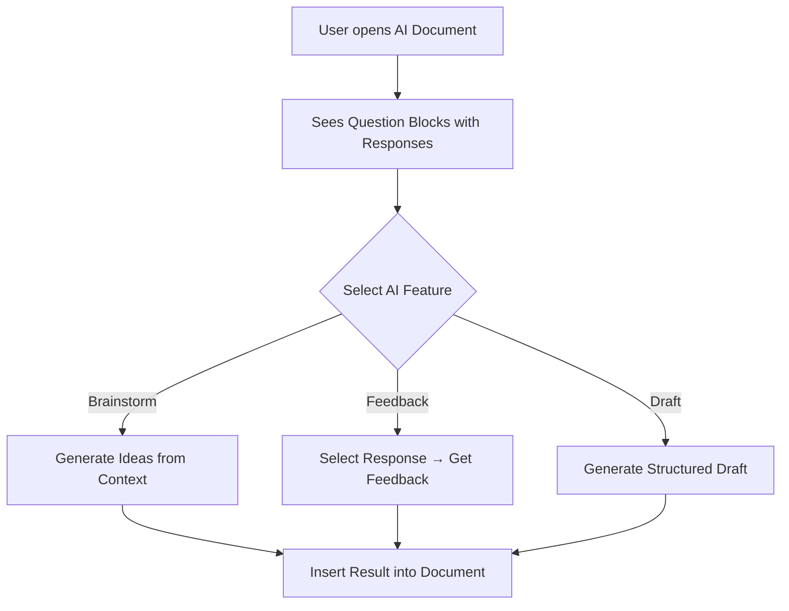

# AI Agentic System Demo - LangGraph Integration

## Overview

This demo showcases the integration of an **agentic AI system** with the document service using custom BlockNote blocks and a mock LangGraph-style architecture. The system provides three main AI features directly integrated into documents:

1. **💡 Brainstorm** - Generate creative ideas based on document context
2. **📝 Feedback** - Provide detailed feedback on selected responses
3. **✍️ Draft** - Create structured drafts from responses and context

## Architecture

### Custom BlockNote Blocks

Located in `src/blocks/schema.ts`, we've created four custom block types:

#### 1. Question Block (❓)
- Container for organizing question-based content
- Groups related responses, context, and notes
- Styled with blue border and background
- Properties: `questionText`, `aiFeatureEnabled`

#### 2. Response Block (💬)
- Individual response entries
- Selectable for AI feedback (click to toggle)
- Can be marked as AI-generated
- Properties: `responseText`, `selected`, `aiGenerated`
- Visual indicator: ✅ when selected, 💬 otherwise

#### 3. Context Block (📋)
- Additional background information
- Styled with orange/yellow theme
- Used by AI features to understand document scope
- Supports inline content

#### 4. Notes Block (📝)
- Supplementary notes and comments
- Styled with purple theme
- Useful for reminders and meta-information
- Supports inline content

### Service Layer

The agentic service follows the same abstraction pattern as other services in the app:

```
IAgenticService (interface)
    ├── WebAgenticService (web implementation)
    └── ElectronAgenticService (electron implementation)
```

**Location:**
- Interface: `src/services/interfaces.ts`
- Web: `src/services/web/agentic.ts`
- Electron: `src/services/electron/agentic.ts`

**Key Methods:**
- `brainstorm(context, questionText?)` → Returns array of ideas
- `provideFeedback(response, context?)` → Returns detailed feedback string
- `generateDraft(context, responses?)` → Returns formatted draft document
- `isAvailable()` → Checks service availability

### UI Components

#### AIAssistantPanel (`src/components/AIAssistantPanel.tsx`)
- Main AI features interface
- Three action buttons for each AI feature
- Real-time processing indicators
- Result display area with "Insert into Document" functionality
- Automatically extracts context and selected responses from editor

#### ResponseSelector (`src/components/ResponseSelector.tsx`)
- Displays all response blocks from the document
- Shows selection count
- Click-to-select interface
- Updates in real-time as editor content changes

#### DocumentPageWithAI (`src/components/DocumentPageWithAI.tsx`)
- Enhanced document editor with custom schema
- Right sidebar with AI Studio and Response panels
- Custom block insertion toolbar (❓💬📋📝)
- Pre-loaded demo content showing all block types
- Dark theme styling for all custom blocks

## How It Works

### 1. User Workflow



### 2. Data Flow

1. **User Action** → Clicks AI feature button
2. **Context Extraction** → AI Assistant reads document blocks
   - Extracts context blocks for background
   - Identifies selected response blocks
   - Gathers question text if available
3. **Service Call** → Calls appropriate agentic service method
4. **Processing** → Mock service simulates AI processing (1.5-2.5s delay)
5. **Result Display** → Shows formatted results in AI panel
6. **Insertion** → User can insert results as new response blocks

### 3. Mock Implementation

The current implementation uses **mock services** that simulate AI responses:

```typescript
// Example: Brainstorm feature
async brainstorm(context: string, questionText?: string): Promise<string[]> {
  await this.simulateDelay(2000); // Simulate processing
  
  // Return pre-generated ideas based on context
  return [
    "💡 Based on context, explore underlying principles...",
    "🎯 Break down concepts into smaller components...",
    // ... more ideas
  ];
}
```

**Benefits of Mock Implementation:**
- ✅ No API keys or external services required
- ✅ Demonstrates complete integration pattern
- ✅ Can be easily replaced with real LangGraph agents
- ✅ Consistent response times for testing

## Demo Features

### Pre-loaded Content

When you open the AI document (`/ai-document`), you'll see:

1. Sample question: "What are the key principles of effective learning?"
2. Two response blocks with example answers
3. Context block with research background
4. Notes block with reminders
5. Instructions on how to use each AI feature

### Interactive Elements

**Block Insertion Toolbar:**
- ❓ Insert Question Block
- 💬 Insert Response Block
- 📋 Insert Context Block
- 📝 Insert Notes Block

**AI Features Panel:**
- 💡 **Brainstorm** - Generates 3-6 creative ideas
- 📝 **Feedback** - Analyzes selected responses with strengths, improvements, and suggestions
- ✍️ **Draft** - Creates a full structured document with introduction, key points, analysis, and conclusion

**Response Selection:**
- Click any response block to select/deselect it
- Selected responses show ✅ indicator
- Selection count displayed in sidebar
- Only selected responses are analyzed for feedback

## Technical Implementation Details

### Custom Schema Integration

```typescript
import { customSchema } from "../blocks/schema";

const editor = useCreateBlockNote({
  schema: customSchema,
  initialContent: [...blocks]
});
```

The custom schema extends BlockNote's default schema with our custom blocks while maintaining all standard features (headings, paragraphs, lists, etc.).

### Block Rendering

Each custom block uses React components for rendering with inline editing:

```typescript
export const ResponseBlock = createReactBlockSpec(
  {
    type: "response",
    propSchema: { selected, aiGenerated, responseText },
    content: "inline", // Supports rich text editing
  },
  {
    render: (props) => <ResponseComponent {...props} />
  }
);
```

### State Management

- **Editor State**: Managed by BlockNote
- **Selection State**: Synchronized between Response Selector and editor blocks
- **AI Results**: Local component state in AIAssistantPanel
- **Processing State**: Loading indicators during async operations

## Extending to Real LangGraph

To replace the mock implementation with actual LangGraph agents:

### 1. Install Dependencies

```bash
npm install @langchain/core @langchain/langgraph
```

### 2. Create LangGraph Agent

```typescript
// src/services/langgraph/agent.ts
import { StateGraph } from "@langchain/langgraph";

export const createBrainstormAgent = () => {
  const workflow = new StateGraph({
    // Define your graph nodes
    nodes: {
      analyzer: analyzeContext,
      ideaGenerator: generateIdeas,
      evaluator: evaluateIdeas,
    },
    // Define edges
    edges: [...]
  });
  
  return workflow.compile();
};
```

### 3. Update Service Implementation

```typescript
// src/services/web/agentic.ts
import { createBrainstormAgent } from '../langgraph/agent';

export class WebAgenticService implements IAgenticService {
  private brainstormAgent = createBrainstormAgent();
  
  async brainstorm(context: string): Promise<string[]> {
    const result = await this.brainstormAgent.invoke({
      context,
      task: "generate_ideas"
    });
    
    return result.ideas;
  }
}
```

### 4. Add Configuration

```typescript
// .env
OPENAI_API_KEY=your_api_key_here
LANGCHAIN_API_KEY=your_langchain_key
```

## File Structure

```
src/
├── blocks/
│   └── schema.ts                      # Custom BlockNote blocks
├── components/
│   ├── AIAssistantPanel.tsx           # AI features UI
│   ├── ResponseSelector.tsx           # Response selection UI
│   ├── DocumentPageWithAI.tsx         # Enhanced document page
│   └── Dashboard.tsx                  # Updated with demo banner
├── services/
│   ├── interfaces.ts                  # IAgenticService interface
│   ├── web/
│   │   └── agentic.ts                 # Web mock implementation
│   ├── electron/
│   │   └── agentic.ts                 # Electron mock implementation
│   ├── factory.ts                     # Service factory (updated)
│   ├── context.tsx                    # useAgentic hook
│   └── index.ts                       # Exports
├── types.ts                           # AI-related types
└── App.tsx                            # Routes for AI document
```

## Usage

### Starting the Demo

**Web Version:**
```bash
npm run dev
```
Navigate to the dashboard and click "Try AI Demo" button.

**Electron Version:**
```bash
npm run electron:dev
```
Access via `/ai-document` route or dashboard button.

### Using AI Features

1. **Brainstorm Ideas:**
   - Open the AI document
   - Ensure context blocks exist (provides better context)
   - Click 💡 Brainstorm in AI Studio panel
   - Wait for ideas to generate
   - Click "Insert into Document" to add results

2. **Get Feedback:**
   - Click on a response block to select it (turns green with ✅)
   - Click 📝 Feedback in AI Studio panel
   - Review strengths, improvements, and suggestions
   - Click "Insert into Document" to add feedback

3. **Generate Draft:**
   - Add multiple responses and context blocks
   - Click ✍️ Draft in AI Studio panel
   - Receive a structured document
   - Insert or copy the draft

### Creating Custom Content

Use the block insertion toolbar to add:
- ❓ Question blocks to organize topics
- 💬 Response blocks for answers/ideas
- 📋 Context blocks for background info
- 📝 Notes blocks for reminders

## Future Enhancements

### Potential Features

1. **Agent Configuration**
   - Adjustable creativity/temperature settings
   - Custom prompts and instructions
   - Different AI models/providers

2. **Advanced Workflows**
   - Multi-step reasoning chains
   - Iterative refinement
   - Collaborative agent systems

3. **Integration Options**
   - Real-time collaboration
   - Version control for AI-generated content
   - Export AI workflows as templates

4. **Analytics**
   - Track AI usage patterns
   - Measure effectiveness of suggestions
   - A/B testing different prompts

## Troubleshooting

### Common Issues

**Q: Custom blocks not appearing?**
- Ensure you're on the `/ai-document` route, not `/document`
- Check that custom schema is imported correctly

**Q: AI features not working?**
- Check browser console for errors
- Verify agentic service is initialized (check factory.ts)
- Ensure proper service exports in index files

**Q: Response selection not updating?**
- Click directly on the response block content area
- Check if onChange listener is properly set up in ResponseSelector

## Demo Highlights

✨ **Seamless Integration** - AI features feel native to the editor  
🎨 **Beautiful UI** - Dark theme with smooth animations  
🚀 **Fast & Responsive** - Mock services provide instant feedback  
🔧 **Easily Extensible** - Clean architecture for real AI integration  
📱 **Cross-Platform** - Works in browser and Electron  

## Conclusion

This demo proves the concept of integrating agentic AI systems directly into document editing workflows. The architecture is production-ready and can be extended with real LangGraph agents, external APIs, or local AI models.

The custom BlockNote blocks provide a flexible foundation for question-response workflows, perfect for research, learning, brainstorming, and knowledge management applications.

---

**Branch:** `agentic-langraph`  
**Created:** November 2025  
**Status:** Demo Complete ✅

