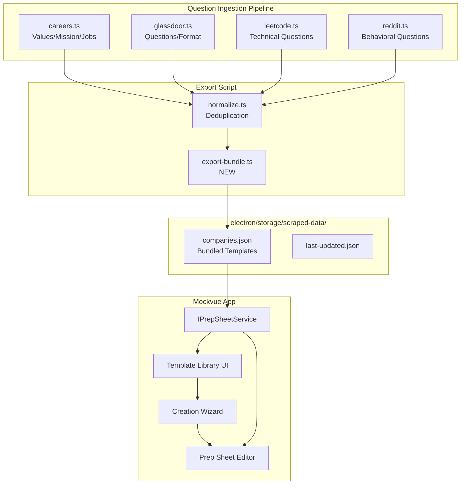

# Design: Prep Sheets Architecture

**Status**: Implemented (Types & Interfaces)
**Author**: OpenCode
**Last Updated**: 2026-04-23

## Problem Statement

The current `Document` type is a flat Q&A list with no structure, no connection to company research, no integration with stories, and no scraper-fed autofill. Users have to manually create everything from scratch.

We need a structured data model that:
1. Represents a company-specific interview cheat sheet with 11 modular sections
2. Supports **fully dynamic sections** (add/remove anytime, not just at creation)
3. Integrates with scraped company data (values, questions, job postings)
4. Provides **company templates** (pre-populated from scraped data)
5. Supports a creation wizard that **autofills from templates and scraped data**
6. References existing stories instead of duplicating them

## Decision: Replace Document with PrepSheet

### Type System Changes (Implemented)

The `Document` type (`src/types.ts`) will be deprecated and replaced with `PrepSheet`.

#### PrepSheet Core Type

```typescript
// Section identifiers - 11 total
export type PrepSheetSectionId =
  | 'company-snapshot'
  | 'role-breakdown'
  | 'story-bank'
  | 'question-mapping'
  | 'company-alignment'
  | 'strengths-weaknesses'
  | 'key-talking-points'
  | 'questions-for-interviewer'
  | 'technical-prep'
  | 'logistics'
  | 'post-interview-reflection';

// PrepSheet metadata - company and role identification
export interface PrepSheetMeta {
  companyName: string;
  roleTitle?: string;
  templateType: 'behavioral' | 'technical' | 'full';
}

// PrepSheet - sections stored as map for dynamic add/remove
export interface PrepSheet {
  id: string;
  userId: string;
  meta: PrepSheetMeta;
  sections: Partial<Record<PrepSheetSectionId, PrepSheetSection>>;
  createdAt: string;
  updatedAt: string;
}
```

**Key Design Decision**: Sections are stored as a `Record` (map) rather than individual optional fields. This allows users to dynamically add/remove sections **at any time** - during creation and during editing.

### Section Types (All Implemented)

Each section has its own interface defined in `src/types.ts`:

```typescript
// Section 1: Company Snapshot
export interface CompanySnapshotSection {
  companyName: string;
  industry?: string;
  product?: string;
  businessModel?: string;
  recentNews?: string;
  competitors?: string[];
  companyValues?: string[];
  mission?: string;
  interviewFormat?: string;
  dataSource: 'scraped' | 'manual' | 'mixed';
}

// Section 2: Role Breakdown
export interface RoleBreakdownSection {
  roleTitle: string;
  teamOrg?: string;
  keyResponsibilities: string[];
  topSkills: string[];
  successLooksLike?: string;
  hiringSignals?: string[];
  dataSource: 'jd-parsed' | 'manual' | 'mixed';
}

// Section 3: Story Bank (references existing stories)
export interface StoryBankSection {
  linkedStoryIds: string[];
  perSheetNotes: Record<string, {
    keyTakeaway?: string;
    followUpAngles?: string[];
  }>;
}

// Section 4: Question Mapping
export interface QuestionMappingSection {
  mappings: QuestionMappingEntry[];
}

export interface QuestionMappingEntry {
  id: string;
  questionText: string;
  linkedStoryIds: string[];
  notes?: string;
  source: 'scraped' | 'manual';
  roleTitle?: string;   // for role-filtering
  stage?: string;       // "phone screen", "onsite", etc.
}

// Section 5: Company Alignment
export interface CompanyAlignmentSection {
  valueStoryMappings: ValueStoryMapping[];
  relevantExperiences?: string[];
  gapsToFrame?: string[];
}

// Section 6: Strengths & Weaknesses
export interface StrengthsWeaknessesSection {
  strengths: StrengthEntry[];
  weaknesses: WeaknessEntry[];
}

// Section 7: Key Talking Points
export interface KeyTalkingPointsSection {
  whyCompany?: string;
  whyRole?: string;
  tellMeAboutYourselfShort?: string;
  careerNarrative?: string;
}

// Section 8: Questions for Interviewer
export interface QuestionsForInterviewerSection {
  roleQuestions: string[];
  teamQuestions: string[];
  companyQuestions: string[];
}

// Section 9: Technical Prep
export interface TechnicalPrepSection {
  keyConcepts?: string[];
  systemDesignPatterns?: string[];
  commonTechnicalQuestions: QuestionMappingEntry[];
  projectDeepDive?: string[];
}

// Section 10: Logistics
export interface LogisticsSection {
  interviewRounds: InterviewRound[];
  notesPerRound?: Record<string, string>;
  thankYouNotes?: string;
}

// Section 11: Post-Interview Reflection
export interface PostInterviewReflectionSection {
  wentWell?: string[];
  didntGoWell?: string[];
  struggledQuestions?: string[];
  storiesToRefine?: string[];
}
```

### Scraper Data Contract (Implemented)

Defines what scrapers output for autofill:

```typescript
// Scraped question with metadata
export interface ScrapedQuestion {
  text: string;
  roleTitle?: string;
  stage?: string;
  source: string;
}

// Data contract for scraper-to-prep-sheet flow
export interface ScrapedCompanyData {
  companyName: string;
  
  // For Company Snapshot section
  values?: string[];
  mission?: string;
  industry?: string;
  product?: string;
  interviewFormat?: string;
  
  // For Question Mapping section
  behavioralQuestions: ScrapedQuestion[];
  
  // For Technical Prep section
  technicalQuestions: ScrapedQuestion[];
  
  // For Role Breakdown section
  roleRequirements?: string[];
  
  // Provenance
  lastScrapedAt: string;
  sources: string[];
}

// JD parsing output
export interface ParsedJobDescription {
  roleTitle: string;
  responsibilities: string[];
  requiredSkills: string[];
  successIndicators?: string[];
  teamOrg?: string;
}
```

### Company Templates (Implemented)

Templates are pre-populated sheets from scraped data that users can select:

```typescript
// Company template - reusable starting point
export interface CompanyTemplate {
  id: string;
  companyName: string;
  isBundled: boolean;  // true for shipped templates
  
  // Pre-populated section data from scraping
  sections: {
    companySnapshot?: Partial<CompanySnapshotSection>;
    questionMapping?: Partial<QuestionMappingSection>;
    technicalPrep?: Partial<TechnicalPrepSection>;
  };
  
  createdAt: string;
  updatedAt: string;
  lastScrapedAt: string;
}

// User can also save their own sheets as templates
export interface UserSavedTemplate {
  id: string;
  userId: string;
  name: string;
  basedOnSheetId: string;
  sections: PrepSheetSectionId[];
  createdAt: string;
}

// Input for creating a new prep sheet
export interface CreatePrepSheetInput {
  companyName: string;
  roleTitle?: string;
  jobDescription?: string;
  sections: PrepSheetSectionId[];
  templateType: 'behavioral' | 'technical' | 'full';
  useTemplate?: string;            // company template ID to use
  useScrapedData?: boolean;        // whether to autofill from scraped data
}
```

### Service Interface (Implemented)

`IPrepSheetService` in `src/services/interfaces.ts`:

```typescript
export interface IPrepSheetService {
  // CRUD operations
  getPrepSheets(): Promise<PrepSheet[]>;
  getPrepSheet(id: string): Promise<PrepSheet | null>;
  createPrepSheet(input: CreatePrepSheetInput): Promise<PrepSheet>;
  updatePrepSheet(id: string, updates: Partial<PrepSheet>): Promise<PrepSheet>;
  deletePrepSheet(id: string): Promise<void>;
  
  // Dynamic section management (add/remove anytime)
  addSection(sheetId: string, sectionId: PrepSheetSectionId): Promise<PrepSheet>;
  removeSection(sheetId: string, sectionId: PrepSheetSectionId): Promise<PrepSheet>;
  updateSection(sheetId: string, sectionId: PrepSheetSectionId, data: Partial<PrepSheetSection>): Promise<PrepSheet>;
  
  // Template library
  getCompanyTemplates(): Promise<CompanyTemplate[]>;
  getCompanyTemplate(companyName: string): Promise<CompanyTemplate | null>;
  getAvailableCompanies(): Promise<string[]>;
  
  // Scraper integration
  getScrapedCompanyData(companyName: string): Promise<ScrapedCompanyData | null>;
  refreshScrapedData(companyName: string): Promise<ScrapedCompanyData>;
  
  // JD parsing
  parseJobDescription(jdText: string): Promise<ParsedJobDescription>;
}
```

## Architecture Overview

### Data Flow



### Scraper-to-PrepSheet Mapping

| Adapter | What it provides | Prep Sheet Section | Field Mapping |
|---------|------------------|-------------------|---------------|
| `careers.ts` | Company values, mission, culture | `company-snapshot` | `mission`, `companyValues` |
| `careers.ts` | Job requirements | `role-breakdown` | `keyResponsibilities`, `topSkills` |
| `glassdoor.ts` | Interview format | `company-snapshot` | `interviewFormat` |
| `glassdoor.ts` | Behavioral questions | `question-mapping` | `behavioralQuestions` |
| `leetcode.ts` | Technical/coding questions | `technical-prep` | `technicalQuestions` |
| `reddit.ts` | Behavioral questions | `question-mapping` | `behavioralQuestions` |

## Storage Strategy

### File Structure

```
electron/storage/
├── user-data/
│   └── {userId}/
│       ├── profile.json
│       ├── resume.json
│       ├── stories.json
│       ├── prep-sheets/
│       │   ├── {sheetId}.json
│       │   └── ...
│       └── ...
├── scraped-data/
│   ├── companies.json        # Bundled scraped data
│   ├── last-updated.json     # Timestamps per company
│   └── ...
```

### Prep Sheet File Format

Each prep sheet is stored as a JSON file with section data as a map:

```json
{
  "id": "sheet-123",
  "userId": "user-abc",
  "meta": {
    "companyName": "Google",
    "roleTitle": "Software Engineer L4",
    "templateType": "full"
  },
  "sections": {
    "company-snapshot": {
      "companyName": "Google",
      "industry": "Technology",
      "product": "Search, Cloud, AI",
      "companyValues": [
        "Focus on the user",
        "Democracy of information"
      ],
      "mission": "Organize the world's information...",
      "interviewFormat": "Phone screen + onsite (4-5 rounds)",
      "dataSource": "scraped"
    },
    "story-bank": {
      "linkedStoryIds": ["story-1", "story-3", "story-7"],
      "perSheetNotes": {
        "story-1": {
          "keyTakeaway": "Customer obsession example"
        }
      }
    },
    "question-mapping": {
      "mappings": [
        {
          "id": "qm-1",
          "questionText": "Tell me about a time you failed",
          "linkedStoryIds": ["story-3"],
          "source": "scraped"
        }
      ]
    }
  },
  "createdAt": "2026-04-17T10:00:00Z",
  "updatedAt": "2026-04-17T12:30:00Z"
}
```

## UI Design

### Creation Wizard (Modal-Based)

The wizard opens as a modal overlay with three steps:

```
Step 1: Company Selection
┌─────────────────────────────────────────────┐
│ Company name: [________________]            │
│                                             │
│ Template available? [Use Google Template]   │
│                                             │
│ ✓ Scraped data available (last: Apr 10)    │
│   - Values: 5 entries                      │
│   - Behavioral Questions: 42               │
│   - Technical Questions: 15                │
│                                             │
│ [Refresh Data]                             │
│                    [Next]                   │
└─────────────────────────────────────────────┘

Step 2: Role Setup
┌─────────────────────────────────────────────┐
│ Paste job description here:                │
│ [_______________________________________]   │
│                                             │
│ Parsed:                                     │
│   Role: Software Engineer                   │
│   Skills: Python, AWS, Kubernetes           │
│                                             │
│                    [Next]                   │
└─────────────────────────────────────────────┘

Step 3: Section Selection
┌─────────────────────────────────────────────┐
│ Core sections:                              │
│   ☑ Company Snapshot (autofilled)          │
│   ☑ Role Breakdown (autofilled)            │
│   ☑ Key Talking Points                     │
│                                             │
│ Behavioral sections:                        │
│   ☑ Story Bank                             │
│   ☑ Question Mapping (autofilled)          │
│   ☐ Company Alignment                      │
│   ☐ Strengths & Weaknesses                 │
│                                             │
│ Technical sections:                         │
│   ☑ Technical Prep (autofilled)            │
│                                             │
│ Logistics:                                  │
│   ☑ Logistics & Notes                      │
│   ☐ Post-Interview Reflection              │
│                                             │
│                [Create Sheet]               │
└─────────────────────────────────────────────┘
```

### Editor UI (Dynamic Sections)

The editor supports adding/removing sections at any time:

```typescript
// Editor state management pattern
interface PrepSheetEditorState {
  sheet: PrepSheet;
  hasChanges: boolean;
  expandedSection: PrepSheetSectionId | null;
}

// Add section (creates default empty section)
function addSection(sectionId: PrepSheetSectionId) {
  const defaultSection = createDefaultSection(sectionId);
  setSheet(prev => ({
    ...prev,
    sections: { ...prev.sections, [sectionId]: defaultSection }
  }));
}

// Remove section (deletes from map)
function removeSection(sectionId: PrepSheetSectionId) {
  setSheet(prev => {
    const newSections = { ...prev.sections };
    delete newSections[sectionId];
    return { ...prev, sections: newSections };
  });
}

// Update section content
function updateSection(sectionId: PrepSheetSectionId, data: Partial<PrepSheetSection>) {
  setSheet(prev => ({
    ...prev,
    sections: {
      ...prev.sections,
      [sectionId]: { ...prev.sections[sectionId], ...data }
    }
  }));
}
```

```
[Prep Sheet Editor]
┌─────────────────────────────────────────────────┐
│ Google - Software Engineer L4                   │
│ Last modified: Apr 17, 2:30 PM                  │
├─────────────────────────────────────────────────┤
│ [+ Add Section] dropdown                        │
├─────────────────────────────────────────────────┤
│                                                 │
│ ┌── Company Snapshot ────────────────────────┐ │
│ │ [Remove Section]                            │ │
│ │ Company: Google                             │ │
│ │ Industry: Technology                        │ │
│ │ ...                                         │ │
│ └─────────────────────────────────────────────┘ │
│                                                 │
│ ┌── Question Mapping ────────────────────────┐ │
│ │ [Remove Section]                            │ │
│ │ Questions (42 from scraped + 3 manual):    │ │
│ │ ...                                         │ │
│ └─────────────────────────────────────────────┘ │
│                                                 │
│ [+ Add Section] shows available:               │
│   - Company Alignment (not added)              │
│   - Strengths & Weaknesses (not added)         │
│   - Post-Interview Reflection (not added)      │
│                                                 │
│ [Save]                                          │
└─────────────────────────────────────────────────┘
```

## Alternatives Considered

1. **Sections as optional fields** (original design)
   - Rejected: Cannot dynamically add/remove after creation. Using a map instead.

2. **Keep Document type, add sections as fields**
   - Rejected: Document is too generic. PrepSheet is a distinct concept.

3. **Duplicate stories in each sheet**
   - Rejected: One master story bank is a design principle. Sheets reference, not duplicate.

4. **Templates only (no autofill wizard)**
   - Rejected: Users want both - templates to start, and autofill during creation.

5. **Full-page wizard instead of modal**
   - Rejected: Modal keeps user on dashboard, feels faster.

## Implementation Status

### Completed
- [x] Type system updated (`src/types.ts`)
- [x] Service interface updated (`src/services/interfaces.ts`)
- [x] `PrepSheet` type with dynamic sections map
- [x] All 11 section interfaces defined
- [x] `ScrapedCompanyData` and `ScrapedQuestion` types
- [x] `CompanyTemplate` and `UserSavedTemplate` types
- [x] `CreatePrepSheetInput` with template/autofill options
- [x] `IPrepSheetService` with CRUD + section management + scraper integration

### Remaining (Future Phases)
- [ ] ElectronPrepSheetService implementation
- [ ] Scraper export script (`tools/question-ingestion/scripts/export-bundle.ts`)
- [ ] Bundled data shipped (`electron/storage/scraped-data/companies.json`)
- [ ] Creation wizard UI built
- [ ] Prep sheet editor UI with dynamic section add/remove
- [ ] Section editor components (11 individual editors)
- [ ] Document migration (old Document → PrepSheet)