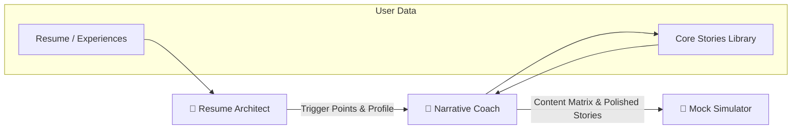
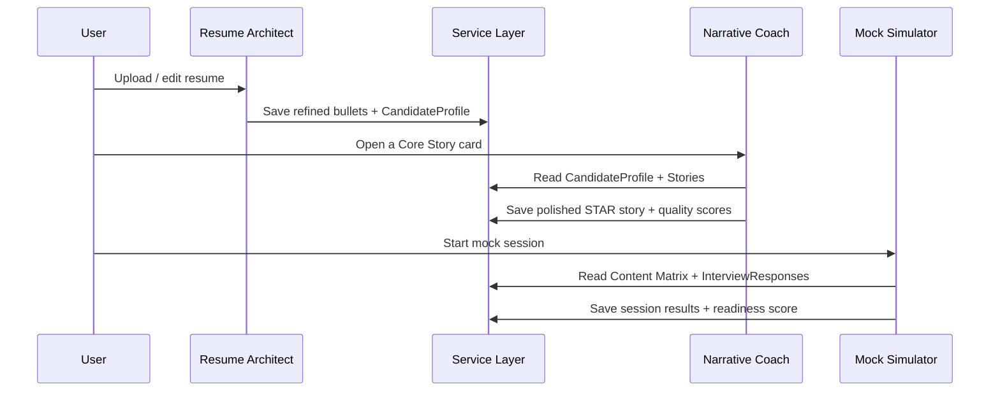

# Feature: AI Interview Prep Agents

**Status**: Planned  
**Last Updated**: 2026-02-28

## User Story

As a job seeker, I want a guided, multi-agent AI workflow that transforms my raw resume into strategic interview-ready narratives so that I can confidently deliver polished, compelling answers in behavioral interviews.

## Overview

Mockvue's AI backbone is a **three-agent handoff pipeline**. Each agent has a distinct persona and responsibility, and the output of one feeds directly into the next. Together, they take a user from "I have a resume" to "I can nail any behavioral question."



> [!IMPORTANT]
> This spec **fully supersedes** the deferred [AI Assistant](./ai-assistant.md) spec. The generic chat-style AI assistant is replaced by these three purpose-built agents. Existing `IAgentService` methods will be extended to support agent-specific workflows.

---

## Agent 1: The Resume Architect

**Persona**: A strategic resume consultant who thinks like a recruiter.  
**Trigger**: User uploads or edits resume data during onboarding or from the Profile page.

### Core Responsibilities

| Responsibility | Description |
|----------------|-------------|
| **Trigger Point Engineering** | Transform passive bullet points into strategic "hooks" — statements that tease the _what_ and the _impact_ but intentionally omit the _how_, forcing the interviewer to ask for the story. |
| **Quantification Forcing** | Actively prompt the user to surface metrics using Google's XYZ Formula: "Accomplished [X] as measured by [Y], by doing [Z]." |
| **Framework Application** | Enforce scannable structures — **PSR** (Problem-Solution-Result) or **CAR** (Challenge-Action-Result) — on every bullet point. |
| **Knowledge Transfer** | Compile a structured **Candidate Profile** (top achievements, competencies, and teased narratives) to pass to the Narrative Coach. |

### Required AI Skills

| Skill | What It Means |
|-------|---------------|
| **Information Extraction** | Parse rambling, unstructured user input and isolate the core achievement. |
| **Brevity Enforcement** | Cap bullet points to a strict word count (~20 words) for ATS compatibility and human readability. |
| **Vocabulary Enhancement** | Swap weak verbs for **Impact Verbs** (e.g., _managed_ → _orchestrated_, _helped_ → _facilitated_, _fixed_ → _remediated_). |

### Inputs & Outputs

| Direction | Data |
|-----------|------|
| **Input** | Raw resume text, parsed `workExperiences[]`, `projects[]` from `IUserService.getResume()` |
| **Output** | Refined bullet points per experience, a `CandidateProfile` object containing trigger points and competency tags, updated resume data saved via `IUserService.saveResume()` |

### Acceptance Criteria

- [ ] User can invoke the Architect on any individual work experience or project
- [ ] Agent identifies and flags weak bullets (no metrics, passive voice, vague impact)
- [ ] Agent suggests rewritten bullets with before/after diff view
- [ ] Agent enforces ≤20-word limit per bullet and flags violations
- [ ] Agent compiles a `CandidateProfile` that is persisted and accessible to Agent 2
- [ ] XYZ quantification prompts appear when metrics are missing
- [ ] User can accept, reject, or edit each suggestion individually

---

## Agent 2: The Narrative Coach

**Persona**: A behavioral interview coach who drills frameworks relentlessly.  
**Trigger**: User navigates to a Core Story card or the Interview Response Builder.

### Core Responsibilities

| Responsibility | Description |
|----------------|-------------|
| **Framework Enforcement** | Guide the user through **STAR** (Situation-Task-Action-Result), with strict time/length proportions: 20% Situation, 10% Task, **60% Action**, 10% Result. Advanced roles may use SHARE or SPSIL. |
| **Detail & Depth Probing** | When the Action phase is thin, probe with investigative follow-ups: _"You said you 'fixed the bug' — what diagnostic tools did you use? How did you isolate the root cause?"_ |
| **Emotional Arc Construction** | Ensure every story has a clear narrative arc: stakes/obstacle → personal intervention → impactful resolution → lesson learned. |
| **Content Matrix Building** | Help the user build a **10-story Content Matrix** — one polished story per Core Competency category — by mapping trigger points from the Architect to the existing 10 behavioral categories. |

### Required AI Skills

| Skill | What It Means |
|-------|---------------|
| **Proportion Analysis** | Measure the length of each STAR section and flag imbalances (e.g., Situation too long, Action too short). Render a visual proportion bar. |
| **Red Flag Detection** | Scan for: the **"We" trap** (using "we" instead of "I" in Action), vague results ("it went well"), badmouthing employers, or missing lessons learned. |
| **Pattern Mapping** | Help the user **pivot** one core story to answer multiple behavioral prompts. E.g., a Failure story can also answer "Tell me about a time you adapted" or "...received negative feedback." |

### Inputs & Outputs

| Direction | Data |
|-----------|------|
| **Input** | `CandidateProfile` from Agent 1, existing `Story[]` from `IUserService.getStories()`, `coreStoryMatches[]` from resume parsing |
| **Output** | Polished STAR narratives saved via `IUserService.updateStory()`, a populated **Content Matrix** (10 stories × N question mappings), proportion/quality scores per story |

### Acceptance Criteria

- [ ] Agent walks user through STAR section-by-section with inline guidance
- [ ] Visual proportion bar shows section length ratios in real time
- [ ] Agent flags Red Flags with inline warnings and suggested rewrites
- [ ] Agent probes for depth when the Action section is below 50% of total length
- [ ] Content Matrix dashboard shows which of the 10 categories have polished stories
- [ ] Agent suggests which questions each story can answer (pattern mapping)
- [ ] User can draft a story from an AI suggestion or from scratch
- [ ] Stories are persisted to `IUserService` with quality metadata (proportion scores, flag count)

---

## Agent 3: The Mock Interview Simulator

**Persona**: A realistic interviewer who adapts difficulty dynamically.  
**Trigger**: User enters Practice Mode from the Interview Prep page.

### Core Responsibilities

| Responsibility | Description |
|----------------|-------------|
| **Adaptive Questioning** | Start with the user's weakest stories (lowest quality scores or empty categories) and escalate difficulty based on response quality. |
| **Real-Time Feedback** | After each response, provide structured feedback: STAR adherence score, proportion analysis, red flag count, and specific improvement suggestions. |
| **Follow-Up Drilling** | Simulate a real interviewer's follow-ups: _"That's interesting — can you tell me more about how you measured success?"_ or _"What would you do differently next time?"_ |
| **Session Summary** | At the end of a mock session, generate a performance report: strengths, weaknesses, stories that need more work, and overall readiness score. |

### Required AI Skills

| Skill | What It Means |
|-------|---------------|
| **Difficulty Calibration** | Analyze user response quality in real time and adjust follow-up intensity. Novice users get gentler coaching; advanced users get curveball follow-ups. |
| **STAR Scoring** | Score each response against the STAR framework (completeness, proportions, specificity, impact). |
| **Session Analytics** | Track response times, confidence patterns, and improvement over multiple sessions. |

### Inputs & Outputs

| Direction | Data |
|-----------|------|
| **Input** | Content Matrix from Agent 2, `InterviewResponse[]` from `IUserService.getInterviewResponses()`, user's target role from `UserProfile` |
| **Output** | Session transcripts, per-response STAR scores, overall readiness score, improvement recommendations, `isPracticed` flags updated on `InterviewResponse` records |

### Acceptance Criteria

- [ ] User can start a timed mock interview session (configurable: 3, 5, or 10 questions)
- [ ] Questions are selected adaptively based on story readiness and past performance
- [ ] User can respond via text input (voice input deferred to future)
- [ ] Real-time STAR adherence feedback appears after each response
- [ ] Follow-up questions drill into weak areas of the response
- [ ] Session summary report is generated and saved
- [ ] Readiness score is displayed on the Dashboard
- [ ] Practice history is viewable with trend charts

---

## Agent Handoff Protocol

The agents share data through the existing service layer, not through direct coupling:



> [!NOTE]
> Each agent reads and writes through `IUserService` and `IAgentService`. No agent calls another agent directly. The user decides when to move between agents — there is no forced linear flow.

---

## New Data Models

The following types will be added to `src/types.ts`:

```typescript
/** Output of the Resume Architect — persisted on the user profile */
interface CandidateProfile {
  triggerPoints: TriggerPoint[];
  competencyTags: string[];
  updatedAt: string;
}

interface TriggerPoint {
  experienceId: string;        // Links to a WorkExperience
  originalBullet: string;
  refinedBullet: string;
  impactVerbs: string[];
  quantified: boolean;         // Has XYZ metrics
  framework: 'PSR' | 'CAR';
}

/** Quality metadata attached to each Story */
interface StoryQuality {
  proportions: {
    situation: number;  // percentage, should be ~20%
    task: number;       // percentage, should be ~10%
    action: number;     // percentage, should be ~60%
    result: number;     // percentage, should be ~10%
  };
  redFlags: RedFlag[];
  overallScore: number;          // 0–100
  questionMappings: string[];    // behavioral prompts this story can answer
}

interface RedFlag {
  type: 'we_trap' | 'vague_result' | 'badmouthing' | 'missing_lesson' | 'passive_voice';
  excerpt: string;
  suggestion: string;
}

/** Mock interview session record */
interface MockSession {
  id: string;
  userId: string;
  targetRole: string;
  questionCount: number;
  responses: MockResponse[];
  readinessScore: number;       // 0–100
  strengths: string[];
  weaknesses: string[];
  startedAt: string;
  completedAt: string;
}

interface MockResponse {
  questionId: string;
  question: string;
  userResponse: string;
  starScore: StoryQuality['proportions'];
  redFlags: RedFlag[];
  feedback: string;
  followUps: string[];
  responseTimeSeconds: number;
}
```

## Service Layer Changes

### `IAgentService` Extensions

```typescript
// New methods on IAgentService
refineResumeBullets(experienceId: string, bullets: string[]): Promise<TriggerPoint[]>;
generateCandidateProfile(resumeData: Resume): Promise<CandidateProfile>;
coachStory(storyId: string, section: 'situation' | 'task' | 'action' | 'result'): Promise<CoachingResponse>;
analyzeStoryQuality(story: Story): Promise<StoryQuality>;
startMockSession(config: MockSessionConfig): Promise<MockSession>;
submitMockResponse(sessionId: string, response: string): Promise<MockResponse>;
endMockSession(sessionId: string): Promise<MockSession>;
```

### `IUserService` Extensions

```typescript
// New methods on IUserService
getCandidateProfile(): Promise<CandidateProfile | null>;
saveCandidateProfile(profile: CandidateProfile): Promise<CandidateProfile>;
getMockSessions(): Promise<MockSession[]>;
getMockSession(id: string): Promise<MockSession | null>;
saveMockSession(session: MockSession): Promise<MockSession>;
```

---

## Relationship to Existing Features

| Existing Feature | Relationship |
|------------------|-------------|
| [Resume Parsing & Import](./user-onboarding.md) | Agent 1 consumes `getResume()` output and refines it. Parsing remains unchanged. |
| [Behavioral Core Stories](./story-management.md) | Agent 2 works directly within the 10-category matrix. Stories are the same data model, enhanced with `StoryQuality` metadata. |
| [Interview Response Builder](./interview-response-builder.md) | Agent 3 consumes responses and maps them to mock sessions. The builder becomes the "composing" step before simulation. |
| [AI Assistant](./ai-assistant.md) | **Superseded.** Generic capabilities (summarize, rewrite, etc.) may survive as inline editor tools, but are no longer the primary AI feature. |

---

## Implementation Phases

### Phase 1: Resume Architect
- Define `CandidateProfile` and `TriggerPoint` types
- Implement `refineResumeBullets()` and `generateCandidateProfile()` on the backend
- Build Architect UI (inline on Profile/Resume pages)
- Integrate before/after diff view for bullet suggestions

### Phase 2: Narrative Coach
- Define `StoryQuality` and `RedFlag` types
- Implement `coachStory()` and `analyzeStoryQuality()` on the backend
- Build proportion visualization component
- Integrate coaching flow into Core Stories page
- Implement pattern mapping (story → questions)

### Phase 3: Mock Interview Simulator
- Define `MockSession` and `MockResponse` types
- Implement mock session API endpoints
- Build Practice Mode UI with timer and adaptive questioning
- Implement session summary and readiness scoring
- Add readiness widget to Dashboard

---

## Success Metrics

| Metric | Target |
|--------|--------|
| Resume bullets refined per user | ≥ 10 |
| Content Matrix completion (stories drafted) | ≥ 7 of 10 categories |
| Story quality score improvement after coaching | ≥ 20-point increase |
| Mock sessions completed per user | ≥ 3 |
| Readiness score improvement over sessions | Positive trend across 3+ sessions |
| User satisfaction with AI coaching | ≥ 4.0 / 5.0 |

## Design References

- See: [story-management.md](./story-management.md) — 10 Core Competency categories
- See: [interview-response-builder.md](./interview-response-builder.md) — Question bank and response data model
- See: [user-onboarding.md](./user-onboarding.md) — Resume parsing pipeline
- See: `docs/FRONTEND.md` — UI patterns for agent interaction views
- See: `ARCHITECTURE.md` — Service abstraction patterns
